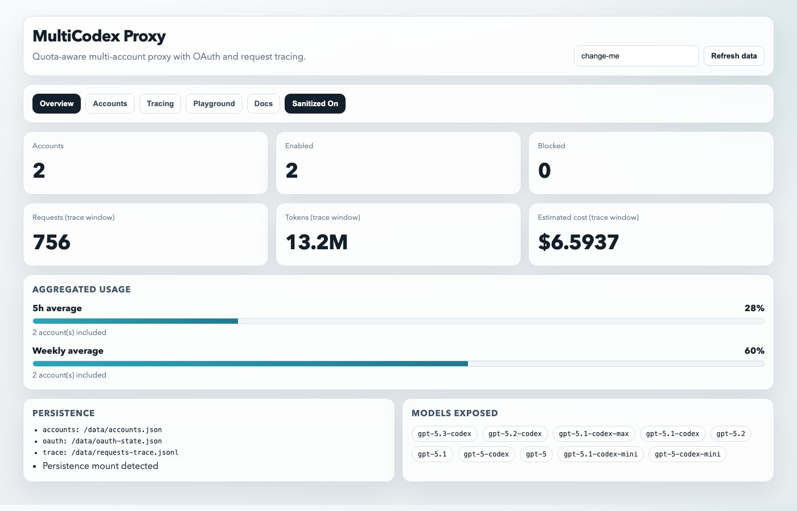
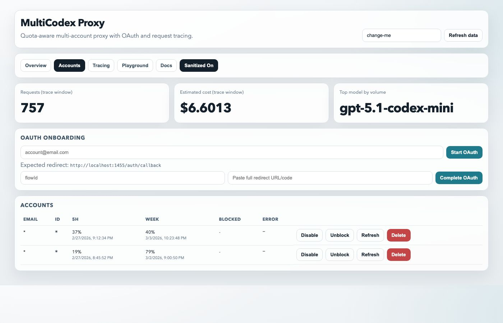
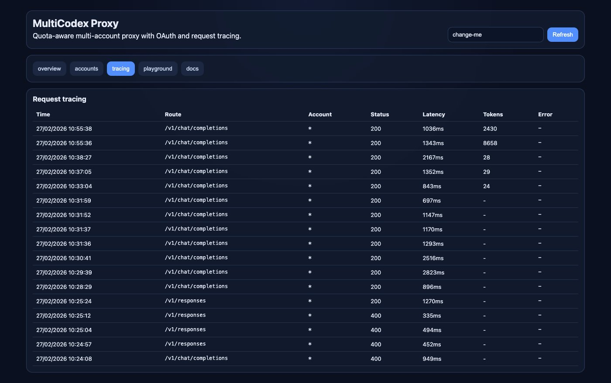
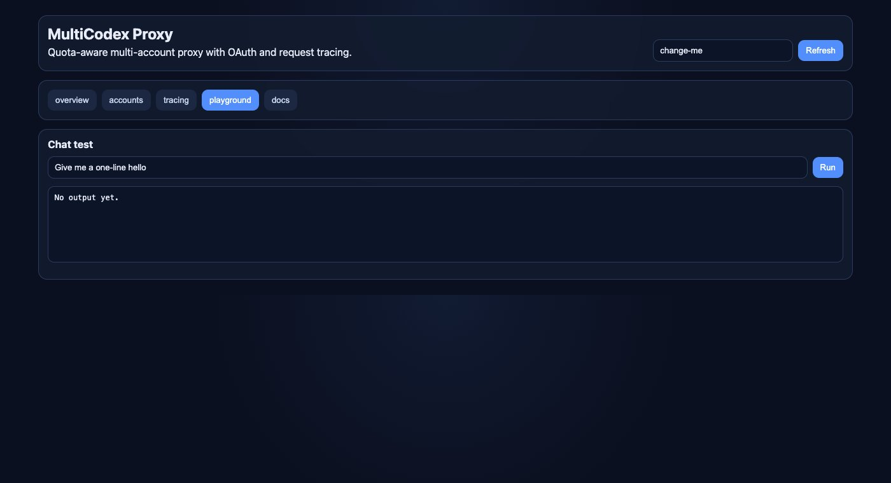
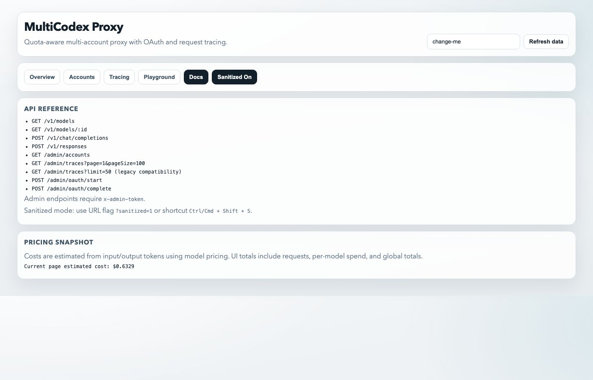

# MultiCodex Proxy

<p align="center">
  <strong>OpenAI-compatible multi-account Codex proxy</strong><br/>
  <sub>Quota-aware routing • OAuth onboarding • Persistent storage • Request tracing • Automatic model discovery</sub>
</p>

<p align="center">
  <a href="https://github.com/thibautrey/multicodex-proxy/stargazers"></a>
  <a href="https://github.com/thibautrey/multicodex-proxy/network/members"></a>
  <a href="https://github.com/thibautrey/multicodex-proxy/issues"></a>
</p>

---

## ✨ What it does

MultiCodex Proxy sits between your clients and OpenAI/Codex endpoints and gives you:

- **OpenAI-compatible API**
  - `GET /v1/models`
  - `GET /v1/models/:id`
  - `POST /v1/chat/completions`
  - `POST /v1/responses`
- **Multi-account routing** with quota-aware failover
- **OAuth onboarding** from dashboard (manual redirect paste flow)
- **Persistent account storage** across container restarts
- **Request tracing v2** (retention capped at 1000, server pagination, tokens/model/error/latency stats, optional full payload)
- **Usage stats endpoint** with global + per-account + per-route aggregates over full history
- **Time-range stats** (`sinceMs` / `untilMs`) while keeping only the latest 1000 full traces

---

## 🖼️ Dashboard gallery

> Screenshots below are taken in **sanitized mode** (`?sanitized=1`).

### Overview


### Accounts


### Tracing


### Playground


### API docs tab


---

## 🧠 Routing strategy

When a request arrives, the proxy chooses an account with this strategy:

1. Prefer accounts untouched on both windows (5h + weekly)
2. Otherwise prefer account with nearest weekly reset
3. Fallback by priority
4. On `429`/quota-like errors, block account and retry on next

---

## 📦 Persistence

Everything important is file-based and survives restart (if `/data` is mounted):

- `/data/accounts.json`
- `/data/oauth-state.json`
- `/data/requests-trace.jsonl`
- `/data/requests-stats-history.jsonl`

Trace retention is capped to the latest **1000** entries.
Stats history is append-only and keeps lightweight request metadata for long-term cost/volume tracking.

> Docker compose already mounts `./data:/data`.

---

## 🚀 Quick start (Docker)

```bash
docker compose up -d --build
```

- Dashboard: `http://localhost:4010`
- Health: `http://localhost:4010/health`

---

## 🔐 OAuth onboarding flow

Because this is often deployed remotely (Unraid/VPS), onboarding uses a manual redirect paste flow:

1. Open dashboard
2. Enter account email
3. Click **Start OAuth**
4. Complete login in browser
5. Copy the full redirect URL shown by browser
6. Paste it in dashboard and click **Complete OAuth**

Default expected redirect URI:

```text
http://localhost:1455/auth/callback
```

---

## 🧪 API examples

### List models

```bash
curl http://localhost:4010/v1/models
```

Example model object returned:

```json
{
  "id": "gpt-5.3-codex",
  "object": "model",
  "created": 1730000000,
  "owned_by": "multicodex-proxy",
  "metadata": {
    "context_window": null,
    "max_output_tokens": null,
    "supports_reasoning": true,
    "supports_tools": true,
    "supported_tool_types": ["function"]
  }
}
```

### Chat completion

```bash
curl -X POST http://localhost:4010/v1/chat/completions \
  -H "content-type: application/json" \
  -d '{
    "model": "gpt-5.3-codex",
    "messages": [{"role":"user","content":"hello"}]
  }'
```

### Read traces

```bash
# Paginated API (recommended)
curl -H "x-admin-token: change-me" \
  "http://localhost:4010/admin/traces?page=1&pageSize=100"
```

```bash
# Legacy compatibility mode
curl -H "x-admin-token: change-me" \
  "http://localhost:4010/admin/traces?limit=50"
```

### Usage stats

```bash
curl -H "x-admin-token: change-me" \
  "http://localhost:4010/admin/stats/usage?sinceMs=1735689600000&untilMs=1738291200000"
```

### Trace stats (historical)

```bash
curl -H "x-admin-token: change-me" \
  "http://localhost:4010/admin/stats/traces?sinceMs=1735689600000&untilMs=1738291200000"
```

Optional filters:
- `accountId=<id>`
- `route=/v1/chat/completions`
- `sinceMs=<epoch_ms>`
- `untilMs=<epoch_ms>`

---

## ⚙️ Environment variables

| Variable | Default | Description |
|---|---|---|
| `PORT` | `4010` | HTTP server port |
| `STORE_PATH` | `/data/accounts.json` | Accounts store |
| `OAUTH_STATE_PATH` | `/data/oauth-state.json` | OAuth flow state |
| `TRACE_FILE_PATH` | `/data/requests-trace.jsonl` | Request trace file (retained to latest 1000 entries) |
| `TRACE_STATS_HISTORY_PATH` | `/data/requests-stats-history.jsonl` | Lightweight request history for long-term stats |
| `TRACE_INCLUDE_BODY` | `true` | Persist full request payloads; trace stats still work when disabled |
| `PROXY_MODELS` | `gpt-5.3-codex,gpt-5.2-codex,gpt-5-codex` | Fallback comma-separated model list for `/v1/models` |
| `MODELS_CLIENT_VERSION` | `1.0.0` | Version sent to `/backend-api/codex/models` for model discovery |
| `MODELS_CACHE_MS` | `600000` | Model discovery cache duration (ms) |
| `ADMIN_TOKEN` | `change-me` | Admin endpoints auth token |
| `CHATGPT_BASE_URL` | `https://chatgpt.com` | Upstream base URL |
| `UPSTREAM_PATH` | `/backend-api/codex/responses` | Upstream request path |
| `OAUTH_CLIENT_ID` | `app_EMoamEEZ73f0CkXaXp7hrann` | OpenAI OAuth client id |
| `OAUTH_AUTHORIZATION_URL` | `https://auth.openai.com/oauth/authorize` | OAuth authorize endpoint |
| `OAUTH_TOKEN_URL` | `https://auth.openai.com/oauth/token` | OAuth token endpoint |
| `OAUTH_SCOPE` | `openid profile email offline_access` | OAuth scope |
| `OAUTH_REDIRECT_URI` | `http://localhost:1455/auth/callback` | Redirect URI |

---

## 🛠️ Local dev

```bash
npm install
npm --prefix web install
npm run build
npm run start
```

---

## 📈 Star history

<a href="https://star-history.com/#thibautrey/multicodex-proxy&Date">
  
</a>

---

## 🤝 Contributing

PRs and issues are welcome.

If you open a PR:
- keep it focused
- include before/after behavior
- include screenshots for UI changes
