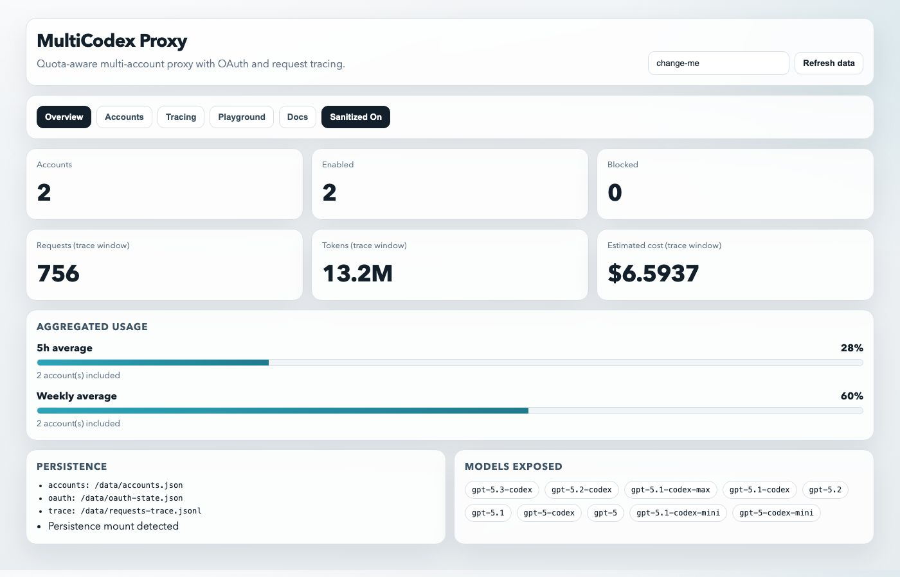
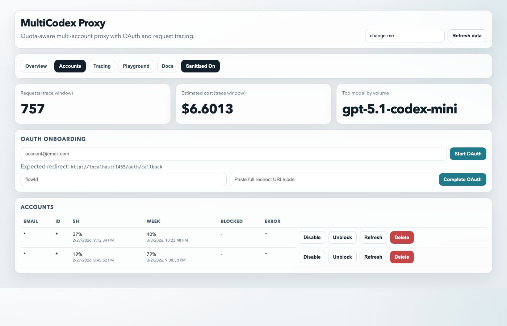
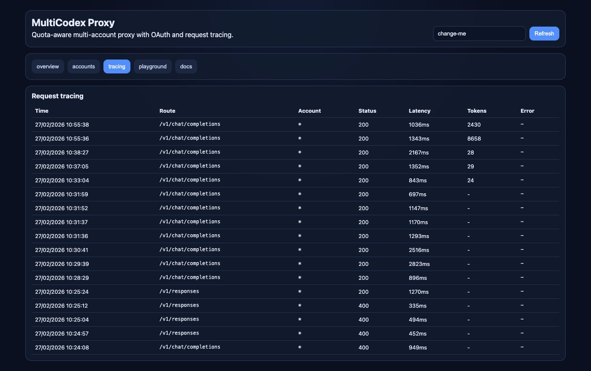
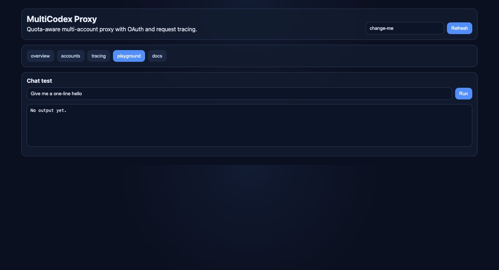
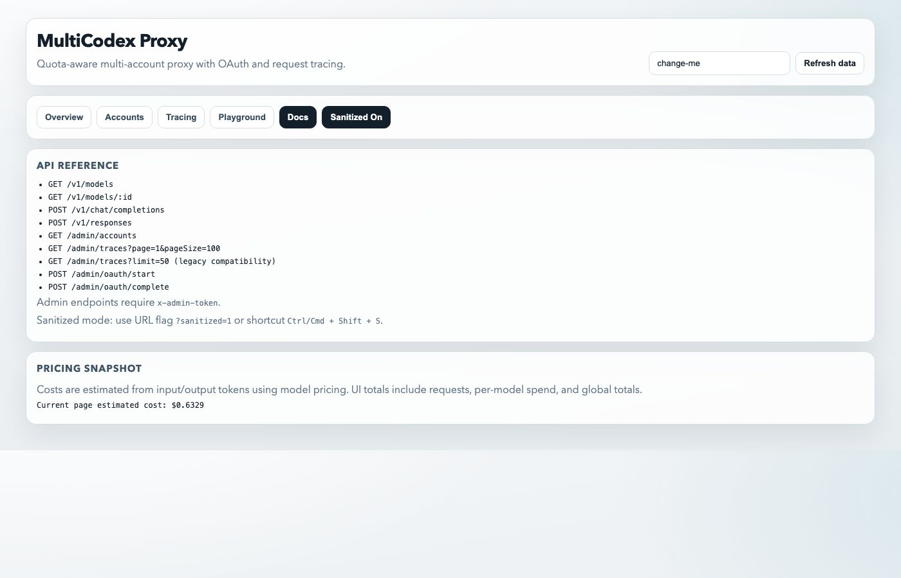

# MultiVibe

<p align="center">
  <strong>OpenAI-compatible multi-provider router</strong><br/>
  <sub>Quota-aware routing • OAuth onboarding • Persistent storage • Request tracing • Automatic model discovery</sub>
</p>

<p align="center">
<a href="https://github.com/thibautrey/multicodex-proxy/stargazers"></a>
  <a href="https://github.com/thibautrey/multicodex-proxy/network/members"></a>
  <a href="https://github.com/thibautrey/multicodex-proxy/issues"></a>
</p>

---

## ✨ What it does

MultiVibe acts as an OpenAI-compatible gateway that lets you route requests across multiple provider accounts while keeping a single API surface. The same proxy routes are exposed under `/v1` and at the root path for clients that expect either style.

- **OpenAI-compatible API**
  - `GET /v1/models`
  - `GET /v1/models/:id`
  - `POST /v1/chat/completions`
  - `POST /v1/responses`
  - `POST /v1/responses/compact`
  - `POST /v1/realtime/calls` (WebRTC SDP negotiation)
  - `GET /v1/realtime/voices` and `/v1/settings/voices` (ChatGPT voice eligibility/catalog)
  - root-path aliases: `/models`, `/chat/completions`, `/responses`, `/responses/compact`
  - compatibility endpoints: `/api/v1/models`, `/api/tags`, `/version`, `/props`, `/v1/props`
- **Streaming over SSE or WebSocket**
  - HTTP streaming uses plain `POST` with `stream: true`
  - HTTP response stream is `text/event-stream`
  - `/v1/responses` also accepts `ws://` / `wss://` and Codex-style JSON `response.create` frames
  - `/v1/chat/completions` and `/v1/responses/compact` remain HTTP-only
- **Realtime voice over WebRTC**
  - opaque multipart/SDP proxy compatible with Codex's native `realtime/calls` transport
  - audio flows directly over the negotiated WebRTC connection; MultiVibe is only on the session setup path
  - account-token refresh and quota-aware account rotation happen before the SDP answer is returned
- **Multi-account routing** with quota-aware failover across OpenAI, OpenAI-compatible, Mistral, z.ai, and Grok Build subscription accounts
- **Model aliases** (for example `small`) with ordered fallback across providers/models, including optional effort-qualified targets like `high:gpt-5.3-codex`
- **Image-aware routing override** that can route image-bearing requests to a chosen exposed model or alias while preserving the originally requested model in traces
- **OAuth onboarding** from dashboard with browser callback or device-code flow, including xAI device OAuth for SuperGrok / X Premium+
- **Manual OpenAI-compatible connections** with custom `baseUrl` + API key
- **Optional local proxy API key** for HTTP and WebSocket clients via `PROXY_API_KEY`
- **Default OpenAI passthrough account** for root-path requests that are not handled by the OpenAI-compatible endpoints
- **Persistent account storage** across container restarts
- **Request tracing v2** (configurable recent-trace retention, server pagination, trace export, tokens/model/error/latency stats, optional full payload, and image payload diagnostics)
- **Usage stats endpoint** with global + per-account + per-route aggregates over full history
- **Time-range stats** (`sinceMs` / `untilMs`) while keeping lightweight history for long-term aggregates
- **zstd-compressed JSON request bodies** for compatible clients

---

## 🖼️ Dashboard gallery

> Screenshots below are taken in **sanitized mode** (`?sanitized=1`).

### Overview



### Accounts



### Tracing



### Playground



### API docs tab



---

## 🧠 Routing strategy

When a request arrives, MultiVibe resolves the requested model to a provider and chooses an account with this strategy:

1. Prefer accounts untouched on both windows (5h + weekly)
2. Otherwise prefer account with nearest weekly reset
3. Fallback by priority
4. On `429`/quota-like errors, temporarily block the account+model and retry on the next candidate

When the requested model is an alias, MultiVibe resolves it to ordered target models and automatically falls back across target models/providers as quotas are hit.

Aliases may also intentionally reuse an already exposed provider model name. In that case, the alias overrides the provider model and routes requests using the alias target order instead.

Alias targets can optionally be prefixed with a reasoning-effort tier: `minimal:`, `low:`, `medium:`, `high:`, or `xhigh:`. Requests using Chat Completions `reasoning_effort` or Responses `reasoning.effort` select the closest matching target tier before falling back.

If a request contains images and `imageRequestModelOverride` is set in admin settings, routing uses that model or alias when it is currently exposed. The upstream payload keeps image parts when translating between Chat Completions `image_url` content and Responses `input_image` content.

---

## 📦 Persistence

Everything important is file-based and survives restart (if `/data` is mounted):

- `/data/accounts.json`
- `/data/oauth-state.json`
- `/data/requests-trace.jsonl`
- `/data/requests-stats-history.jsonl`

Recent trace retention defaults to the latest **1000** entries and can be changed with `TRACE_RETENTION_MAX`.
Stats history is append-only and keeps lightweight request metadata for long-term cost/volume tracking.

> Docker compose already mounts `./data:/data`.

---

## 🚀 Quick start (Docker)

```bash
docker compose up -d --build
```

- Dashboard: `http://localhost:1455`
- Health: `http://localhost:1455/health`

---

## 🔐 OAuth onboarding flow

Because this is often deployed remotely (private environment/VPS), OpenAI onboarding supports both browser callback and device-code flows. The browser callback flow uses a manual redirect paste step:

1. Open dashboard
2. For OpenAI accounts, enter the account email
3. Choose **Browser callback** and click **Start OAuth**
4. Complete login in browser
5. Copy the full redirect URL shown after the callback completes
6. Paste that URL in the dashboard and click **Complete OAuth**

For headless or remote setups, choose **Device code** instead. The dashboard opens
the verification page, shows a one-time code, and completes automatically after
you approve the login.

For Grok Build, choose **Grok Build (subscription)** and start the device login.
The proxy sends the resulting subscription bearer to
`https://cli-chat-proxy.grok.com/v1`, together with the same client headers as
the official Grok Build CLI. It does not use `XAI_API_KEY` and therefore does
not switch the account to pay-per-token API billing.

An existing official CLI session can instead be imported with **Import
configured auth.json**. The server reads `XAI_AUTH_PATH` (default
`~/.grok/auth.json`) and ignores `xai::api_key` entries. In Docker, mount the
file read-only and point `XAI_AUTH_PATH` at the container path. Deprecated
pre-OIDC `web_login` entries are also rejected because the current Grok CLI no
longer treats them as a reliable sampling credential:

```yaml
services:
  multivibe:
    environment:
      - XAI_AUTH_PATH=/run/secrets/grok-auth.json
    volumes:
      - ${HOME}/.grok/auth.json:/run/secrets/grok-auth.json:ro
```

Device OAuth is preferred when the CLI and proxy may run concurrently. Refresh
tokens rotate; importing the same session into independent stores can make one
consumer stale after the other refreshes it.

Mistral, z.ai, and generic OpenAI-compatible accounts use manual token/API-key
entry in the dashboard. Generic OpenAI-compatible accounts also require a
`baseUrl`.

Default expected redirect URI:

```text
http://localhost:1455/auth/callback
```

---

## 🧪 API examples

### List models

```bash
curl http://localhost:1455/v1/models
```

When `PROXY_API_KEY` is set, send it as either a Bearer token or `x-api-key`.
To identify traffic from several applications without changing authentication or
quota behavior, set `PROXY_API_KEYS` to a JSON object whose names identify the
applications and whose values are their keys. For example:

```env
PROXY_API_KEYS={"mobile-app":"key-for-mobile","back-office":"key-for-back-office"}
```

Each accepted request stores the matching application name in its trace. Usage
is available per application from `/admin/stats/usage` in `byApplication`, and
can be filtered with `?application=mobile-app`. `PROXY_API_KEY` remains supported
and is attributed to the application name `default`. All keys share the same
account pool, routing, quota state, and failover behavior.
An authenticated dashboard session can still use the API. Configure
`ADMIN_TOKEN` as well when using the dashboard so it can establish that
session:

```bash
curl -H "Authorization: Bearer $PROXY_API_KEY" \
  http://localhost:1455/v1/models
```

Example model object returned:

```json
{
  "id": "gpt-5.3-codex",
  "object": "model",
  "created": 1730000000,
  "owned_by": "multivibe",
  "metadata": {
    "context_window": null,
    "max_output_tokens": null,
    "supports_reasoning": true,
    "supports_tools": true,
    "supported_tool_types": ["function"]
  }
}
```

### Chat completion

```bash
curl -X POST http://localhost:1455/v1/chat/completions \
  -H "content-type: application/json" \
  -d '{
    "model": "gpt-5.3-codex",
    "messages": [{"role":"user","content":"hello"}]
  }'
```

### Streaming responses

```bash
curl -N -X POST http://localhost:1455/v1/responses \
  -H "content-type: application/json" \
  -d '{
    "model": "gpt-5.3-codex",
    "input": "hello",
    "stream": true
  }'
```

### WebSocket responses

```js
const ws = new WebSocket("ws://localhost:1455/v1/responses", {
  headers: {
    Authorization: "Bearer YOUR_TOKEN",
  },
});

ws.onmessage = (event) => {
  console.log(JSON.parse(event.data));
};

ws.onopen = () => {
  ws.send(
    JSON.stringify({
      type: "response.create",
      model: "gpt-5.3-codex",
      input: [
        { role: "user", content: [{ type: "input_text", text: "hello" }] },
      ],
      stream: true,
    }),
  );
};
```

### Realtime voice (WebRTC)

MultiVibe proxies the unified Realtime WebRTC handshake rather than rebuilding
voice as separate speech-to-text, Responses, and text-to-speech requests. This
keeps latency low, preserves interruption/VAD and data-channel events, and keeps
audio off the proxy after session setup.

The default mode uses OpenAI ChatGPT/Codex OAuth accounts already configured in
MultiVibe and forwards to ChatGPT's native Codex Realtime endpoint:

```env
REALTIME_PROVIDER=openai
```

Point compatible Codex clients at the proxy's API base:

```toml
experimental_realtime_webrtc_call_base_url = "https://multivibe.example/v1"
```

The client sends the native multipart form (`sdp` plus `session`) to
`POST /v1/realtime/calls`. The response is the upstream SDP answer. The same
route is also exposed without the `/v1` prefix.

To use a standard OpenAI API key instead of a ChatGPT subscription, configure
an `openai-compatible` account whose `baseUrl` is `https://api.openai.com/v1`,
then set:

```env
REALTIME_PROVIDER=openai-compatible
```

This is intentionally opt-in because Realtime API-key traffic is billed on the
API platform and must never be selected silently as a fallback from a ChatGPT
subscription. A custom full upstream URL can be supplied when needed:

```env
REALTIME_WEBRTC_CALL_URL=https://api.openai.com/v1/realtime/calls
REALTIME_REQUEST_TIMEOUT_MS=30000
```

Voice eligibility and the selected ChatGPT voice can be checked through:

```bash
curl -H "Authorization: Bearer $PROXY_API_KEY" \
  "https://multivibe.example/v1/realtime/voices?spoken_language=fr-FR&voice_mode=advanced"
```

An upstream response without `selected`, or a rejected upstream request, means
the selected ChatGPT account/workspace is not currently voice-enabled. This is
the same server-side signal Codex Desktop uses for its unavailable state.

### Create model alias

```bash
curl -X POST http://localhost:1455/admin/model-aliases \
  -H "x-admin-token: change-me" \
  -H "content-type: application/json" \
  -d '{
    "id": "small",
    "targets": ["gpt-5.1-codex-mini", "devstral-small-latest"],
    "enabled": true,
    "description": "Small coding model pool"
  }'
```

Targets may also be effort-qualified:

```json
{
  "id": "reasoning-coder",
  "targets": ["low:gpt-5.3-codex", "high:gpt-5.3-pro"],
  "enabled": true
}
```

### Update routing settings

```bash
curl -X PATCH http://localhost:1455/admin/settings \
  -H "x-admin-token: change-me" \
  -H "content-type: application/json" \
  -d '{
    "defaultPassthroughAccountId": "openai-account-id",
    "imageRequestModelOverride": "vision-model-or-alias"
  }'
```

Use an empty string for either field to clear it.

### Read traces

```bash
# Paginated API (recommended)
curl -H "x-admin-token: change-me" \
  "http://localhost:1455/admin/traces?page=1&pageSize=100"
```

```bash
# Legacy compatibility mode
curl -H "x-admin-token: change-me" \
  "http://localhost:1455/admin/traces?limit=50"
```

To inspect which headers a client sends, temporarily start the proxy with
`TRACE_INCLUDE_HEADERS=true`. The trace detail and the `Full Trace Object` then
include `requestHeaders`. Header names are preserved, while credentials,
cookies, tokens, session values, and similar secrets are replaced with
`[REDACTED]`. Header tracing is disabled by default and is not written to the
long-term stats history.

### Attribute Codex usage by repository

MultiCodex can correlate Codex Desktop sessions with Git repositories without
patching Codex. A user-level official `SessionStart` hook sends the Codex
`session_id`, working directory, sanitized Git remote, and worktree metadata to
MultiCodex. Incoming traces carry the same id in `thread-id`, so project
attribution is stored directly in recent traces and long-term usage history.

Requests routed through LiteLLM can identify their project with the
`X-LiteLLM-Key-Alias` header. When present, this alias takes precedence over
Codex session attribution and is used as the project name with a stable project
identifier.

Set a dedicated registration token on the server when possible:

```bash
CODEX_PROJECT_REGISTRATION_TOKEN=replace-with-a-random-token
```

When this variable is unset, `ADMIN_TOKEN` is accepted for compatibility. If
both are empty, project registration is disabled.

The simplest installation path is in the dashboard: open **Tracing**, click
**Install hook** next to **Codex session attribution**, then paste and execute
the copied command in a terminal on the machine that runs Codex. The same
command works on macOS and Linux.

Install the hook once on every machine or remote execution host that runs Codex:

```bash
read -s MULTICODEX_PROJECT_TOKEN
export MULTICODEX_PROJECT_TOKEN
node scripts/install-codex-project-hook.mjs --url http://192.0.2.149:1455
unset MULTICODEX_PROJECT_TOKEN
```

For the local macOS Codex app, run the same command in a terminal on the Mac,
from a local checkout of this repository. The installer writes to the Codex
home of the host where it runs (`~/.codex` by default); running it in a remote
Codex shell only installs the remote hook.

Codex does not run a newly installed or changed user hook until its exact
definition has been reviewed and trusted. On the same local or remote execution
host, open Codex, run `/hooks`, select `SessionStart`, review the MultiCodex
command, and press `t` to trust it. Then start or resume a session. The hook
overview must show the `SessionStart` hook as active rather than awaiting
review.

The installer preserves existing `~/.codex/hooks.json` entries, stores the
secret in `~/.codex/multicodex-project.json` with mode `0600`, and installs a
synchronous, fail-open hook. New, resumed, cleared, and compacted sessions are
registered. See the [official Codex hooks documentation](https://developers.openai.com/codex/hooks/).

Project endpoints:

- `POST /admin/codex-sessions` with `x-codex-project-token`
- `GET /admin/codex-sessions` with `x-admin-token`
- `GET /admin/codex-projects` with `x-admin-token`

### Usage stats

```bash
curl -H "x-admin-token: change-me" \
  "http://localhost:1455/admin/stats/usage?sinceMs=1735689600000&untilMs=1738291200000"
```

### Trace stats (historical)

```bash
curl -H "x-admin-token: change-me" \
  "http://localhost:1455/admin/stats/traces?sinceMs=1735689600000&untilMs=1738291200000"
```

### Export traces

```bash
curl -H "x-admin-token: change-me" \
  "http://localhost:1455/admin/traces/export.zip?sinceMs=1735689600000&untilMs=1738291200000" \
  -o traces-export.zip
```

Optional filters:

- `accountId=<id>`
- `route=/v1/chat/completions`
- `projectId=<project-id>`
- `sinceMs=<epoch_ms>`
- `untilMs=<epoch_ms>`

Model alias admin endpoints:

- `GET /admin/model-aliases`
- `POST /admin/model-aliases`
- `PATCH /admin/model-aliases/:id`
- `DELETE /admin/model-aliases/:id`

Proxy API key admin endpoints:

- `GET /admin/proxy-api-keys` (secrets are masked)
- `POST /admin/proxy-api-keys` with `{"application":"staging-worker"}`
- `DELETE /admin/proxy-api-keys/:id`

Keys created from the dashboard are persisted in `STORE_PATH`, take effect
immediately, and are returned in full only by the creation response. Keys from
`PROXY_API_KEY` and `PROXY_API_KEYS` remain read-only in the dashboard.

Settings endpoints:

- `GET /admin/settings`
- `PATCH /admin/settings`

OAuth admin endpoints:

- `POST /admin/oauth/start`
- `GET /admin/oauth/status/:flowId`
- `POST /admin/oauth/complete`
- `POST /admin/oauth/device/poll`
- `POST /admin/grok/import`

To start Grok Build device OAuth, call `POST /admin/oauth/start` with
`{"provider":"xai","method":"device"}`. Poll the returned `flowId` through the
same `/admin/oauth/device/poll` endpoint used by OpenAI device OAuth.

---

## ⚙️ Environment variables

| Variable                          | Default                                   | Description                                                         |
| --------------------------------- | ----------------------------------------- | ------------------------------------------------------------------- |
| `PORT`                            | `1455`                                    | HTTP server port                                                    |
| `STORE_PATH`                      | `/data/accounts.json`                     | Accounts, aliases, API keys, and settings store                     |
| `OAUTH_STATE_PATH`                | `/data/oauth-state.json`                  | OAuth flow state                                                    |
| `TRACE_FILE_PATH`                 | `/data/requests-trace.jsonl`              | Recent request trace file                                           |
| `TRACE_STATS_HISTORY_PATH`        | `/data/requests-stats-history.jsonl`      | Lightweight request history for long-term stats                     |
| `CODEX_PROJECTS_PATH`             | `/data/codex-projects.json`               | Persistent Codex session-to-project registry                        |
| `TRACE_RETENTION_MAX`             | `1000`                                    | Number of recent full traces to retain; minimum effective value is 100 |
| `TRACE_INCLUDE_BODY`              | `false`                                   | Persist full request payloads when explicitly enabled; trace stats still work when disabled |
| `TRACE_INCLUDE_HEADERS`           | `false`                                   | Persist sanitized inbound request headers in recent traces; credentials and tokens are redacted, and headers are excluded from long-term stats history |
| `USAGE_STALE_WHILE_REVALIDATE`    | `true`                                    | Serve stale usage, or route with a missing snapshot, while refreshing in the background |
| `USAGE_STALE_MAX_AGE_MS`          | `1800000`                                 | Maximum snapshot age eligible for stale-while-revalidate; older snapshots block for refresh |
| `REQUEST_BODY_LIMIT`              | `100mb`                                   | Max accepted JSON or decompressed zstd request body size            |
| `PROXY_MODELS`                    | `gpt-5.3-codex,gpt-5.2-codex,gpt-5-codex` | Fallback comma-separated model list for `/v1/models`                |
| `MODELS_CLIENT_VERSION`           | `0.144.1`                                 | Codex version sent to OpenAI model discovery and runtime requests     |
| `MODELS_CACHE_MS`                 | `600000`                                  | Model discovery cache duration (ms)                                 |
| `MODELS_STALE_WHILE_REVALIDATE`   | `true`                                    | Serve a bounded stale model catalog while refreshing it in the background |
| `MODELS_STALE_MAX_AGE_MS`         | `1800000`                                 | Maximum model-catalog age eligible for stale-while-revalidate       |
| `ADMIN_TOKEN`                     | empty                                     | Admin endpoints auth token; empty disables the admin-token check    |
| `CODEX_PROJECT_REGISTRATION_TOKEN` | `ADMIN_TOKEN`                            | Limited token accepted by the Codex session registration endpoint   |
| `PROXY_API_KEY`                   | empty                                     | Optional Bearer or `x-api-key` required by HTTP and WebSocket proxy endpoints |
| `PROXY_API_KEYS`                  | empty                                     | JSON object of application names to proxy keys; attribution only, with shared auth behavior and quotas |
| `CHATGPT_BASE_URL`                | `https://chatgpt.com`                     | OpenAI/ChatGPT upstream base URL                                    |
| `REALTIME_PROVIDER`               | `openai`                                  | Realtime account provider (`openai` or `openai-compatible`)         |
| `REALTIME_WEBRTC_CALL_URL`        | empty                                     | Optional full Realtime WebRTC upstream URL                          |
| `REALTIME_REQUEST_TIMEOUT_MS`     | `30000`                                   | Realtime SDP request timeout (ms)                                   |
| `UPSTREAM_PATH`                   | `/backend-api/codex/responses`            | OpenAI upstream request path                                        |
| `UPSTREAM_COMPACT_PATH`           | `/backend-api/codex/responses/compact`    | OpenAI upstream path for `/v1/responses/compact`                    |
| `MISTRAL_BASE_URL`                | `https://api.mistral.ai`                  | Mistral upstream base URL                                           |
| `MISTRAL_UPSTREAM_PATH`           | `/v1/responses`                           | Mistral upstream path for responses                                 |
| `MISTRAL_COMPACT_UPSTREAM_PATH`   | `/v1/responses/compact`                   | Mistral upstream path for compact responses                         |
| `ZAI_BASE_URL`                    | `https://api.z.ai`                        | z.ai upstream base URL                                              |
| `ZAI_UPSTREAM_PATH`               | `/v1/chat/completions`                    | z.ai upstream path for responses routed through chat completions    |
| `ZAI_COMPACT_UPSTREAM_PATH`       | `/v1/chat/completions`                    | z.ai upstream path for compact responses                            |
| `XAI_BASE_URL`                    | `https://cli-chat-proxy.grok.com/v1`      | Grok Build subscription upstream base URL                           |
| `XAI_RESPONSES_PATH`              | `/responses`                              | Grok Build Responses upstream path                                  |
| `XAI_CHAT_COMPLETIONS_PATH`       | `/chat/completions`                       | Grok Build Chat Completions upstream path                           |
| `XAI_MODELS_PATH`                 | `/models`                                 | Grok Build model-discovery path                                     |
| `XAI_AUTH_PATH`                   | `~/.grok/auth.json`                       | Official Grok CLI credential file read by the import action         |
| `XAI_OAUTH_ISSUER`                | `https://auth.x.ai`                       | Trusted xAI OAuth issuer                                            |
| `XAI_OAUTH_CLIENT_ID`             | official Grok Build client id             | OAuth client used for device login and refresh                      |
| `XAI_OAUTH_SCOPES`                | official Grok Build scope set             | Comma- or space-separated xAI OAuth scopes                          |
| `XAI_CLIENT_VERSION`              | `0.2.114`                                 | Grok CLI version header sent to subscription endpoints              |
| `XAI_CLIENT_IDENTIFIER`           | `grok-pager`                              | Grok CLI client identifier header                                   |
| `XAI_TOKEN_AUTH`                  | `xai-grok-cli`                            | xAI subscription token-auth selector                                |
| `XAI_USER_AGENT`                  | generated Grok CLI user agent             | User-Agent sent to Grok Build endpoints                             |
| `OAUTH_CLIENT_ID`                 | `app_EMoamEEZ73f0CkXaXp7hrann`            | OpenAI OAuth client id                                              |
| `OAUTH_AUTHORIZATION_URL`         | `https://auth.openai.com/oauth/authorize` | OAuth authorize endpoint                                            |
| `OAUTH_TOKEN_URL`                 | `https://auth.openai.com/oauth/token`     | OAuth token endpoint                                                |
| `OAUTH_DEVICE_AUTHORIZATION_URL`  | `https://auth.openai.com/api/accounts/deviceauth/usercode` | OAuth device-code start endpoint                 |
| `OAUTH_DEVICE_TOKEN_URL`          | `https://auth.openai.com/api/accounts/deviceauth/token` | OAuth device-code polling endpoint                      |
| `OAUTH_DEVICE_VERIFICATION_URL`   | `https://auth.openai.com/codex/device`    | OAuth device-code verification page                                 |
| `OAUTH_DEVICE_REDIRECT_URI`       | `https://auth.openai.com/deviceauth/callback` | OAuth device-code token exchange redirect URI                   |
| `OAUTH_SCOPE`                     | `openid profile email offline_access`     | OAuth scope                                                         |
| `OAUTH_AUDIENCE`                  | empty                                     | Optional OAuth audience                                             |
| `OAUTH_REDIRECT_URI`              | `http://localhost:1455/auth/callback`     | Redirect URI                                                        |
| `TOKEN_REFRESH_MARGIN_MS`         | `60000`                                   | Refresh OAuth tokens this long before expiry                        |
| `ACCOUNT_FLUSH_INTERVAL_MS`       | `5000`                                    | Debounce interval for writing modified account state to disk        |
| `MAX_ACCOUNT_RETRY_ATTEMPTS`      | `10`                                      | Max accounts to try on quota/rate-limit errors                      |
| `MAX_UPSTREAM_RETRIES`            | `5`                                       | Retries per upstream request for transient 5xx/transport errors; quota rotates accounts |
| `UPSTREAM_BASE_DELAY_MS`          | `2000`                                    | Base backoff delay for upstream retries (ms)                        |
| `HANG_RETRY_INTERVAL_MS`          | `10000`                                   | Delay between retry cycles when all accounts are exhausted (ms)     |
| `HANG_RETRY_MAX_DURATION_MS`      | `120000`                                  | Max total time to hang-and-retry before returning 429 to client (ms) |
| `RATE_LIMIT_BLOCK_MS`             | `60000`                                   | Duration to block an account+model after a 429 response (ms)        |
| `EXCLUDED_PROVIDER_MODELS`        | empty                                     | Comma-separated `provider:model` list to prevent routing a model to specific providers |
| `EMPTY_RESPONSE_BLOCK_THRESHOLD`  | `3`                                       | Empty assistant outputs before temporarily blocking account+model   |
| `EMPTY_RESPONSE_BLOCK_DURATION_MS`| `30000`                                   | Duration of an empty-response account+model block (ms)              |
| `EMPTY_RESPONSE_WINDOW_MS`        | `300000`                                  | Time window for counting empty assistant outputs (ms)               |
| `SENTRY_DSN`                      | empty                                     | Optional Sentry DSN; unset disables Sentry                          |
| `SENTRY_ENVIRONMENT`              | `NODE_ENV` or `production`                | Sentry environment                                                  |
| `SENTRY_TRACES_SAMPLE_RATE`       | `0.1`                                     | Sentry performance sampling rate                                    |

---

Grok Build subscription access is intended for the account owner or another
trusted operator. Do not expose a subscription-backed instance as a public
multi-tenant service, and review the current xAI terms before deployment.

---

## 🛠️ Local dev

```bash
npm install
npm --prefix web install
npm run dev
```

For a production-style local run:

```bash
npm run build
npm run start
```

---

## 📈 Star history

<a href="https://star-history.com/#thibautrey/multicodex-proxy&Date">
  
</a>

---

## 🤝 Contributing

PRs and issues are welcome.

If you open a PR:

- keep it focused
- include before/after behavior
- include screenshots for UI changes
